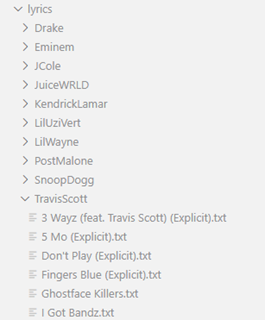
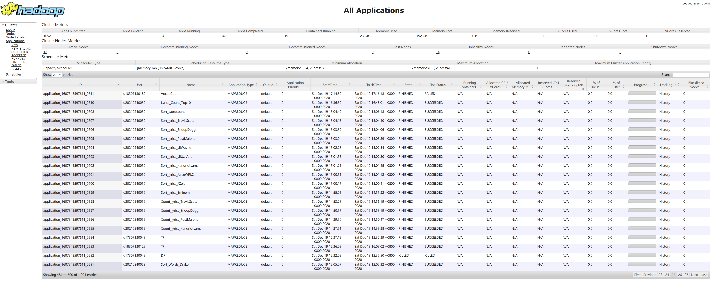
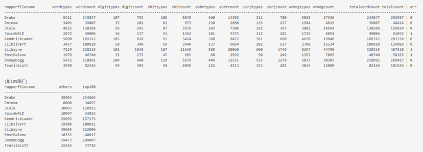

# 说唱歌手用词分析

此次实践的主要目的如下：

+ 使用hadoop框架
+ 熟悉 Map Reduce 编程
+ 简单分析说唱歌手的用词特点

实践的主要步骤如下：

1. 选择一组说唱歌手
2. 获取他们所有作品的歌词
3. 统计歌词中每个单词的数量
4. 按出现的数量对单词进行排序
5. 分析所得的数据并得出结论

本次实践涉及的所有代码在 github 上：https://github.com/XINKINGBO-1206/lyrics

## 说唱歌手的选择

选择的说唱歌手要有代表性，所以找了一个[排名网站](https://www.ranker.com/list/most-famous-rappers-right-now/celebrity-lists)，选择了排名前 10 的 10 位说唱歌手作为本次分析的对象，见下图：


选择了下面十位歌手

1. Drake 
2. Eminem  
3. JCole
4. JuiceWRLD
5. KendrickLamar 
6. LilUziVert    
7. LilWayne   
8. PostMalone
9. SnoopDogg    
10. TravisScott 

## 歌词的获取

核心思路如下

```python
# 搜索每个说唱歌手的作品
for rapper in rappers:
    songs = search_song(rapper)
    # 获取作品对应的歌词
    for song in songs:
        lyric = get_lyric(song)
        # 写入本地文件
        write_to_write(lyric, rapper/song.txt)
```

需要用到两个数据接口

1. 搜索歌手所有歌曲
2. 获取指定歌曲的歌词内容

数据源随便选择某国内音乐平台，本次实践选择了[QQ音乐](https://y.qq.com/)，因为它版权最多

+ 搜索接口
    + 地址为：https://c.y.qq.com/soso/fcgi-bin/client_search_cp
    + 参数有：
        + remoteplace：'txt.yqq.song'
        + format：'json'
        + outCharset： 'utf-8'
        + t： 0
        + n：每一页返回的音乐数量
        + p：分页序号
        + w：搜索关键字，此处为说唱歌手的名字
+ 歌词接口
    + 地址为：https://c.y.qq.com/lyric/fcgi-bin/fcg_query_lyric_new.fcg
    + 参数有：
        + format：'json'
        + outCharset：'utf-8'
        + g_tk：5381
        + nobase64：1
        + songmid：音乐ID，在搜索结果中获取

编写代码将歌词文件爬取下来，代码见 `./rapper_lyrics_from_qq.py` ，执行 `./download_script.py`即可自动下载。

按照歌手名组织文件目录结构，如下图所示：



将歌词文件上传到 HDFS 的输入目录 input 下

```shell
hadoop fs -put ~/lyrics/* input
```

## 单词计数

### mapred streaming

Hadoop 提供的单词计数只是单纯的按空格分割单词，没有考虑到标点符号等复杂的情况，因此我们需要自己编写Mapper 和 Reducer 代码。

本次实践选用编程语言为 python ，需要使用 Hadoop 提供的 `mapred streaming` 工具来运行整个框架。

 `mapred streaming` 传入参数如下：

| 参数名   | 参数含义             | 样例值                     |
| -------- | -------------------- | -------------------------- |
| -file    | 发送到集群节点的文件 | ~/dev/wordcount/mapper.py  |
| -mapper  | mapper               | ~/dev/wordcount/mapper.py  |
| -reducer | reducer              | ~/dev/wordcount/reducer.py |
| -input   | 输入目录             | input/$file                |
| -output  | 输出目录             | output/$file               |

样例命令：

```shell
mapred streaming -D mapred.job.name="Count_$file" \
	-file ~/dev/wordcount/mapper.py \
	-mapper ~/dev/wordcount/mapper.py \
	-file ~/dev/wordcount/reducer.py \
	-reducer ~/dev/wordcount/reducer.py 
	-input input/$file \
	-output output/$file
```

### mapper

mapper 的主要工作是从歌词文件中提取出有意义的单词，单词具有以下要求

+ 大小写统一，这里统一成小写
+ 允许出现连词符 ” - “，如：seven-eleven
+ 允许出现缩写符 ” ’ “，如：I'm
+ 允许出现星号 " * "，如：s**t，不文明的词汇在歌词文件中会用星号覆盖，我们做单词统计时要允许星号的存在
+ 单词左右两边不能出现符号，如：high" 需要变成 high

整个处理流程如下图所示：


源代码见下：

> 注：集群上默认的 python 环境是 2.7，代码中不能出现中文，所以下方的代码无法直接在集群上运行，需将中文注释改写成英语或者直接删除。

mapper.py

```python
#!/usr/bin/env python

import sys
from string import punctuation

# 从标准输入流中读取文本行
for line in sys.stdin:
    # 转化成小写
    line = line.strip().lower()
    # 按空格区分单词
    words = line.split()
    
    for word in words:
        # 移除单词两边的符号
        word = word.strip(punctuation)
        # 如果单词不为空
        if word:
            # 输出 <key, value> 到标准输出流，这些文本经过框架最终会进入 reducer 的标准输入
            print '%s\t%s' % (word, 1)
```

### reducer

reducer 的主要工作是根据来自 mapper 的 （word, 1） 键值对来统计每个 word 的数量。

reducer 读取的是 Hadoop 框架按照 word 排好序的结果

整个计数过程示意图如下：


reducer.py

```python
#!/usr/bin/env python

import sys

current_word = None
current_count = 0
word = None

# 从标准输入流中读取文本行，这些数据来自 mapper
for line in sys.stdin:
    # 去除文本行两边的空格
    line = line.strip()

    # 以制表符为标准解析读入的文本行，解析成”单词“和”数量“
    word, count = line.split('\t', 1)

    # 由于读入的变量全是字符串，我们在计数的时候需要装换成数字类型 int
    try:
        count = int(count)
    except ValueError:
        # 出错了，未知错误就忽略这一行
        continue

    # Hadoop 框架会按照 word 排序，对于 reducer 来说统计重复出现的单词数量
    if current_word == word:
        current_count += count
    else:
        if current_word:
            # 写入输出文件
            print '%s\t%s' % (current_word, current_count)
        current_count = count
        current_word = word

# 将最后一个单词数量写入输出文件
if current_word == word:
    print '%s\t%s' % (current_word, current_count)
```

通过 mapred stream 运行词频统计后，得到输出结果，可以在 hdfs 的 output 目录下看到。



为了更好地查看结果，可以执行下面的指令将结果从 hdfs 拉到本地 outputs 目录下

```shell
hadoop fs -get output/$file outputs
```


## 词频排序

在统计完每个单词出现的次数后，我们需要按照出现的次数对单词进行排序。

充分利用 MapReduce 框架的特点，即 (key, value) 从 mapper 到 reducer 的过程中会自动根据 key 排序

我们可以把词频统计得到 (word, count) 作为排序 mapper 的输入，要根据 count 排序，就把 count 加到 key 里面，即 mapper 输出 (count|word, count)

此时的 key 就是 count|word，MapReduce 框架根据 count|word 排序就达到了根据 count 排序的效果

### mapper

mapper 的主要工作就是将  (word, count)  转变为 (count|word, count)

工作流程如下图所示：


源代码如下：

```python
#!/usr/bin/env python

import sys

# 从标准输入流中读取
for line in sys.stdin:
    # 去除两端的空格
    line = line.strip()
    # 如果这一行不为空
    if line:
        # 按照空格将这一行文本解析为 [word, num]
        word, num = line.split()
        # 构造一个复合的键 num|word, 让 MapReduce 利用此键排序
        composite_word = ('000000' + num)[-6:] +'|'+ word
        # 输出 (num|word, num) 到标准输出流，这些文本经过框架最终会进入 reducer 的标准输入
        print '%s\t%s' % (composite_word, num)
```

### reducer

排序的工作主要有 Hadoop 框架本身实现，不需要 reducer 做额外的工作，原样输出即可

流程图见下：


源代码如下：

```python
#!/usr/bin/env python

import sys

# 定义变量用于保存单词总数
count = 0

# 从标准输入流中读取文本行，这些数据来自 mapper
for line in sys.stdin:
    # 去除两端的空格
    line = line.strip()

    # 解析出单词和次数
    composite_word, num = line.split('\t')

    # 直接原样输出
    print '%s\t%s' % (composite_word, num)

    try:
        # 计入单词总数
        count += int(num)
    except ValueError:
        pass
    
# 把单词总数写入输出
print 'num of words is %s' % (count)
```

依然通过 mapred stream 进行排序，得到输出结果，可以在 hdfs 的 sorted 目录下看到。


为了更好地查看结果，可以执行下面的指令将结果从 hdfs 拉到本地 sorted 目录下

```shell
hadoop fs -get sorted/$file sorted
```


## 数据统计并分析

从每个歌手作品中单词出现的数量可以提取出哪些信息呢？

1. 可以对比歌手们的词汇量，即作品中出现的单词的种类
2. 把单词分成若干种类（纯单词，缩写词，数字，连词，垃圾话）后，可以分析每个歌手用词的成分。
3. 可以充分利用词频统计的结果，来验证说唱界的 2 - 8 原则，即出现次数最多的少部分单词占总单词量的大部分。
4. ……

数据统计的脚本为：`./result/analyse.py`

运行结果截图如下：



可视化后的结果：


说唱界的 ”2 - 8 原则“


## 实践平台

使用了张老师提供的 Hadoop 集群，

ip: 10.176.51.6

username：u2021024*

password：*******

hadoop：3.0.0

## 参考链接

1. https://www.tutorialspoint.com/unix/shell_scripting.htm
2. https://www.ranker.com/list/most-famous-rappers-right-now/celebrity-lists
3. https://www.oreilly.com/library/view/data-algorithms/9781491906170/ch01.html
4. https://hadoop.apache.org/docs/r3.0.0/hadoop-streaming/HadoopStreaming.html
5. https://www.michael-noll.com/tutorials/writing-an-hadoop-mapreduce-program-in-python/
6. https://hadoop.apache.org/docs/current/hadoop-project-dist/hadoop-hdfs/HDFSCommands.html
7. … …

## 使用

```shell
pip install -r requirements.txt
python ./rapper_lyrics_from_qq.py
```

nltk 字典包的安装如果报出`连接远程服务器失败的错误`是因为被墙了，给终端设置代理即可


```shell

# cmd 设置代理
> set HTTP_PROXY=http://127.0.0.1:1080
> set HTTPS_PROXY=http://127.0.0.1:1080

# 进入 python
> python

>>> import nltk
>>> nltk.download()
```
弹出一个用`tkinter`实现的GUI界面，点击 `all-corpora`，点击 `Download` 即可。